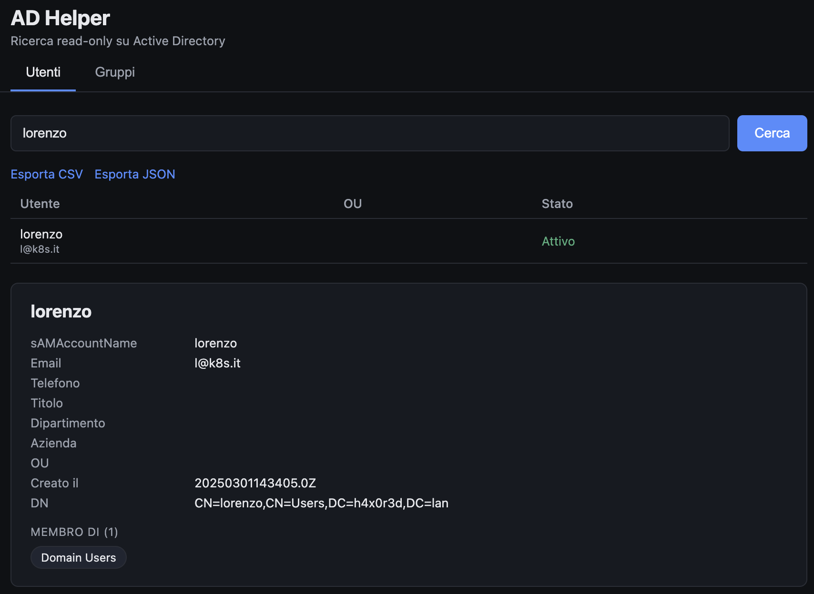
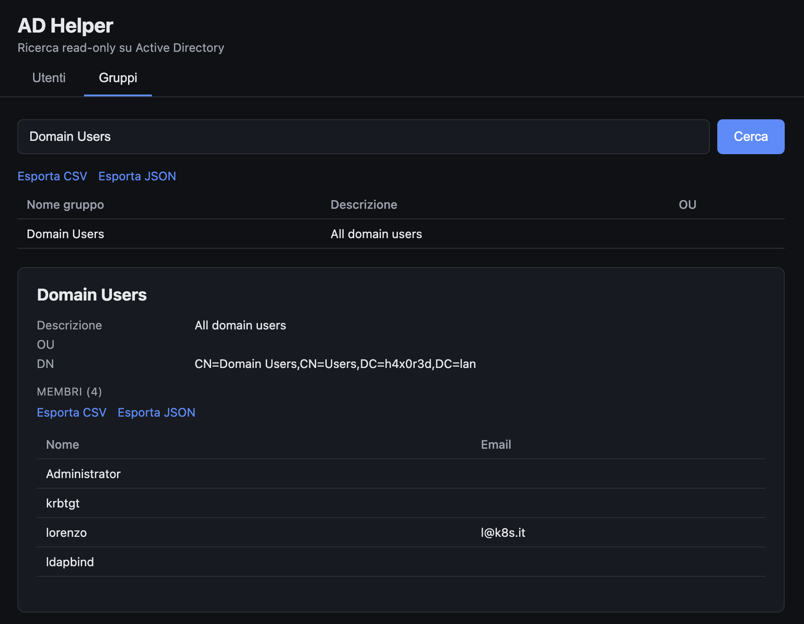

# AD Helper

Lightweight, **read-only** web UI to query Active Directory: search users, see which OU they live in and which groups they belong to (`memberOf`, plus the primary group), search groups and list their members. It runs in Docker on Mac or Windows (WSL), so you do not need to install any LDAP client.

**Why it exists.** In most domains you cannot open the AD console, but every authenticated user can already read users, groups and memberships with a plain `ldapsearch` (the default ACLs grant read access to `Authenticated Users` through the `Pre-Windows 2000 Compatible Access` group). AD Helper puts a friendly UI on top of that permission, so you can answer "who is in this group?" without opening a ticket or asking anyone for access.

It changes nothing on AD: it binds with a normal account and only issues LDAP `search` requests.



## Quick start

1. Copy `.env.example` to `.env` and fill in the values (AD URL, base DN, bind account):

   ```bash
   cp .env.example .env
   ```

2. Start it:

   ```bash
   docker compose up --build
   ```

3. Open [http://localhost:3080](http://localhost:3080)

The app listens on `127.0.0.1` only, so it is reachable just from the machine running Docker.

After editing `.env`, recreate the container (Compose reads the file only at creation time):

```bash
docker compose up -d --force-recreate
```

## Environment variables

| Variable | Required | Description |
|---|---|---|
| `AD_URL` | yes | e.g. `ldaps://ad.example.internal` |
| `AD_BASE_DN` | yes | e.g. `DC=ad,DC=example,DC=internal` |
| `AD_BIND_DN` | yes | account used to bind, e.g. `jdoe@ad.example.internal`. A normal domain user is enough |
| `AD_BIND_PASSWORD` | yes* | password of the bind account |
| `AD_BIND_PASSWORD_FILE` | no | path to a file containing the password (Docker secret), takes precedence over `AD_BIND_PASSWORD` |
| `AD_BIND_DN_FILE` | no | same, for the username |
| `PORT` | no | default `3000` |
| `AD_DISABLE_TLS_CHECK` | no | `true` disables certificate verification on `ldaps://` (tests only) |

\* either `AD_BIND_PASSWORD` or `AD_BIND_PASSWORD_FILE` is required.

Do not know your base DN? Ask the domain controller, no credentials needed:

```bash
ldapsearch -x -LLL -H ldap://dc01.ad.example.internal -s base -b "" defaultNamingContext
```

## User guide

### 1. Find a user

Open the **Users** tab and type a name, `sAMAccountName` or email. Click a row to open the detail: main attributes, OU as a readable path, active/disabled state and every group the user belongs to, including the primary group (for example `Domain Users`, which AD does not list in `memberOf`).

Click a group chip to jump to that group.

### 2. Find a group and its members

Open the **Groups** tab, search by name and click a row. You get the member list with name and email. Very large groups work too: the app goes past the per-response limit of AD with ranged retrieval, and it includes users that have the group only as primary group.



### 3. Export

Every list has **Export CSV** and **Export JSON** links, for user results, group results and group members. Handy for audits and access reviews.

## Features

- Search users by name, `sAMAccountName` or email.
- User detail: main attributes, OU (readable path), active/disabled state, group membership (primary group included).
- Search groups by name.
- Group detail: members, including groups larger than the AD limit of 1500 values per response (ranged retrieval) and users whose primary group is the one you are looking at.
- CSV / JSON export for user lists, group lists and group members.

## API

- `GET /api/users/search?q=...`
- `GET /api/users/search.csv?q=...` / `.json`
- `GET /api/users/:dn` (URL-encoded DN)
- `GET /api/groups/search?q=...`
- `GET /api/groups/search.csv?q=...` / `.json`
- `GET /api/groups/:dn`
- `GET /api/groups/:dn/members.csv` / `.json`
- `GET /api/health`

Example:

```bash
curl -s "http://localhost:3080/api/groups/search.json?q=finance" | jq '.[].cn'
```

## Security notes

- Read-only by construction: only LDAP `search` operations, no add/modify/delete.
- Use `ldaps://` whenever possible. With plain `ldap://` the bind password travels in clear text.
- Keep the port bound to `127.0.0.1`. Do not expose it publicly without adding authentication.
- Never commit `.env`. It is in `.gitignore`; prefer `*_FILE` variables and Docker secrets.
- It uses a single bind account, so everyone using the instance looks like the same identity in the domain controller logs. Binding with each user's own credentials is a possible improvement.
- Whether authenticated users can read the directory depends on your ACLs. If your security team restricted them, this tool will show less (or nothing).

## Local development without Docker

```bash
npm install
cp .env.example .env   # and fill it in
npm start
```
